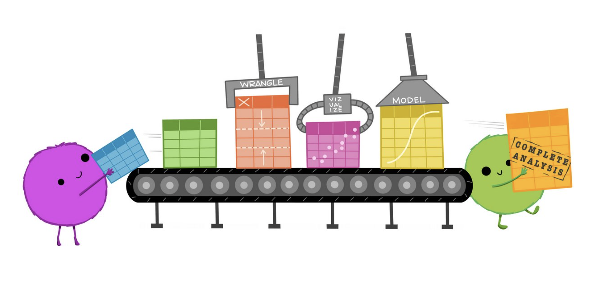

I’m Sonia! I’m a Data Scientist working from the beautiful Mexico City. 

I'm a real-world practitioner focusing on data analysis and machine learning. I 
consider myself a **Data & Stats Enthusiast + Lover** :heart:. 
I actively look for challenging projects :eyes: and 
learning new methodologies :nerd:.

In this site you can read more about my experience and interests related to data, 
data analysis and statistics, problem solving and collaboration.

[Illustration by @allisonhorst](https://twitter.com/allison_horst)

Outside of work, I love to paint, bake and eat. I spend my time with my dogs :dog: and cats :cat:.
