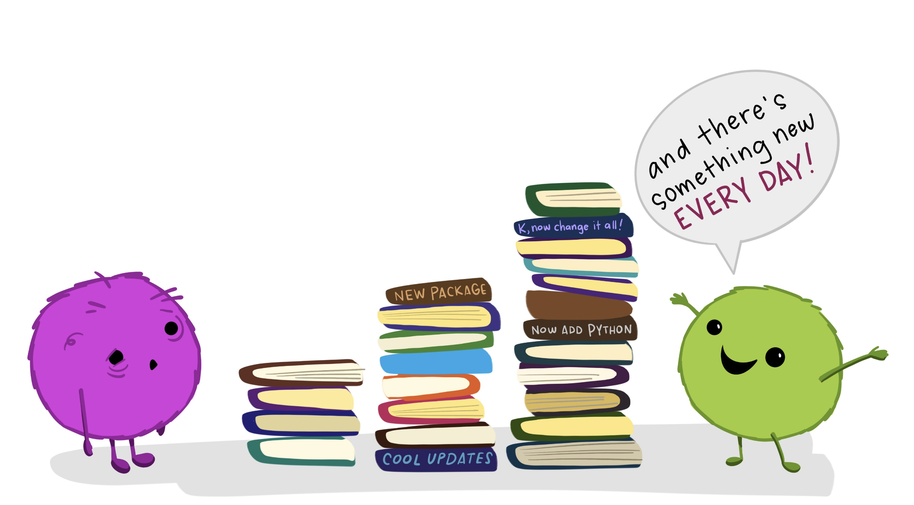

I've worked in data for over 10 years within 
multidisciplinary teams implementing data solutions in multiple industries. 

- Committed to building data science solutions
- Liaison between consultants and clients for technical aspects
- Advocate of reproducible and collaborative workflows

As a consultant, I've developed the ability to manage multiple data projects effectively. 
I've participated in data analysis pipelines co-creation, collaboration and monitoring.

During these years I've worked on **methodologies** like:

  * statistical bayesian modeling, frequentist and non parametric approach,
  * machine learning classification
  * similarity algorithms
  * association rules
  * forecasting algorithms
  * time series and longitudinal analysis
  * statistical design experimentation and other causal inference

[Illustration by @allisonhorst](https://twitter.com/allison_horst)

